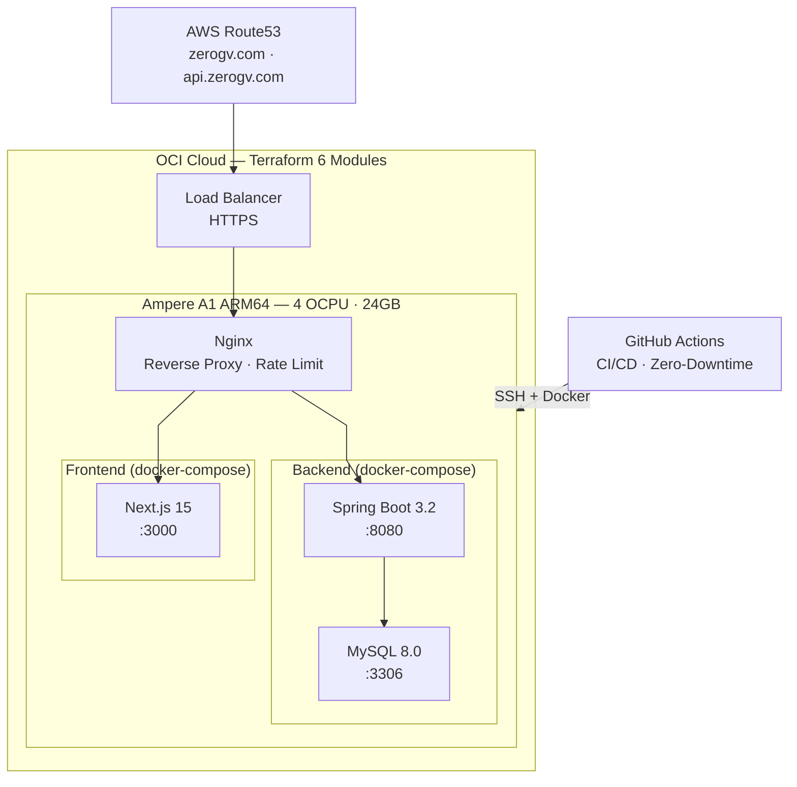

<div align="center">

# 🚀 ZeroGravity Backend


**Spring Boot REST API for Emotion Tracking & Personal Wellness Platform**


</div>

---

## 📑 Table of Contents

1. [📖 Overview](#-overview)
2. [✨ Key Features](#-key-features)
3. [🛠 Tech Stack](#-tech-stack)
4. [🏗 Architecture](#-architecture)
5. [📂 Project Structure](#-project-structure)
6. [📡 API Endpoints](#-api-endpoints)
7. [🔐 Authentication Flow](#-authentication-flow)
8. [🔧 Technical Challenges & Solutions](#-technical-challenges--solutions)
9. [🚀 Getting Started](#-getting-started)
10. [🗓 Roadmap](#-roadmap)
11. [🔗 Related](#-related)
12. [👤 Author](#-author)

---

## 📖 Overview

ZeroGravity Backend is a Spring Boot REST API that powers the emotion tracking and personal wellness platform. It provides secure authentication, emotion recording, analytics, and AI-powered insights.

> 📌 Part of the ZeroGravity full-stack project. Refactored from a collaborative Spring Boot project with basic CRUD APIs into a production-ready API.
> [Frontend Repository](https://github.com/zerogravity-project/zerogravity-react)

### Why ZeroGravity Backend?

- 🔐 **Secure Authentication** - JWT integration with NextAuth, supporting Google & Kakao OAuth
- 📊 **Analytics Engine** - Timezone-aware emotion statistics and chart data
- 🤖 **AI-Powered Insights** - Google Gemini API for emotion prediction and period analysis
- 🚀 **Zero-Downtime Deploy** - Build-first strategy with automatic rollback

---

## ✨ Key Features

| Feature | Description | Tech |
|---------|-------------|------|
| 🔐 **JWT Authentication** | NextAuth integration with 15-min access / 30-day refresh tokens | jjwt, Spring Security |
| 👤 **User Management** | Profile, consent tracking, account deletion | MyBatis, Snowflake ID |
| 📊 **Emotion Analytics** | Daily/Moment records, level/count/reason statistics | MySQL, CONVERT_TZ |
| 🤖 **AI Insights** | Emotion prediction, period analysis & insights | Google Gemini API |
| 🚀 **Zero-Downtime Deploy** | Build-first strategy with auto-rollback | Docker, GitHub Actions |
| 🔒 **API Security** | Rate limiting, caching, security headers | Nginx, Spring Security |

---

## 🛠 Tech Stack

| Category | Technologies |
|:--------:|:-------------|
| **Framework** | Spring Boot 3.2.5, Java 17 |
| **Database** | MySQL 8.0, MyBatis 3.0.3 |
| **Authentication** | JWT (jjwt 0.12.5), Spring Security, NextAuth Integration |
| **AI** | Google Gemini API |
| **Infrastructure** | Docker, Docker Compose, Nginx |
| **Cloud** | OCI (Ampere A1 ARM64, Flexible Load Balancer) |
| **IaC** | Terraform (VCN, Compute, LB, Certificate, Storage, Monitoring modules) |
| **CI/CD** | GitHub Actions (Zero-Downtime, Auto-Rollback) |
| **DNS/SSL** | AWS Route53, Let's Encrypt (ACME) |
| **Monitoring** | OCI Monitoring (CPU/Memory/Container Health Alarms, Email Alerts) |
| **Documentation** | SpringDoc OpenAPI (Swagger) |

---

## 🏗 Architecture



---

## 📁 Project Structure

```
zerogravity/src/main/java/com/zerogravity/myapp/
├── common/               # Shared infrastructure
│   ├── config/           # DB, Swagger, Web, Jackson configs
│   ├── security/         # JWT, @AuthUserId annotation
│   ├── exception/        # Global exception handler
│   ├── dto/              # ApiResponse, ErrorResponse
│   └── util/             # TimezoneUtil
│
├── auth/                 # Authentication domain
│   ├── controller/       # OAuth2 endpoints
│   ├── service/          # RefreshTokenService, cleanup
│   ├── dao/              # RefreshToken mapper
│   └── dto/              # AuthResponse, RefreshRequest
│
├── user/                 # User management domain
│   ├── controller/       # User profile, consent
│   ├── service/          # UserService
│   ├── dao/              # MyBatis mapper
│   └── dto/              # User, ConsentUpdateRequest
│
├── emotion/              # Core emotion tracking domain
│   ├── controller/       # Emotion records CRUD
│   ├── service/          # EmotionService, EmotionRecordService
│   ├── dao/              # MyBatis mappers
│   └── dto/              # EmotionRecord, request/response DTOs
│
├── chart/                # Analytics domain
│   ├── controller/       # Statistics endpoints
│   ├── service/          # ChartService
│   └── dto/              # Chart response DTOs
│
└── ai/                   # AI features domain
    ├── controller/       # AI prediction endpoints
    ├── service/          # Gemini API integration
    ├── dao/              # AI analysis cache mapper
    └── dto/              # SummaryData, prediction DTOs
```

### Why Domain-Driven Architecture?

**🔍 The Challenge**: Business logic was hard to follow because the original project used traditional layered architecture, grouping all controllers, services, and DAOs by technical concern.

**💡 The Solution**: Reorganized code by business domain while preserving the working layer structure. No complete rewrite needed.

**✅ The Result**:
- **`common/`**: Shared infrastructure (security, config, exceptions, utilities)
- **`auth/`**: Authentication & JWT token management
- **`user/`**: User profile and consent management
- **`emotion/`**: Core emotion tracking (records, emotions)
- **`chart/`**: Analytics and statistics
- **`ai/`**: Gemini-powered predictions and analysis

---

## 🔗 API Endpoints

Base URL: `https://api.zerogv.com`

### Authentication

| Method | Endpoint | Description |
|--------|----------|-------------|
| POST | `/auth/verify` | Verify OAuth token and issue JWT |
| POST | `/auth/refresh` | Refresh access token |

### User

| Method | Endpoint | Description |
|--------|----------|-------------|
| GET | `/users/me` | Get current user profile |
| DELETE | `/users/me` | Delete account |
| PUT | `/users/consent` | Update consent preferences |
| POST | `/users/logout` | Logout and invalidate tokens |

### Emotion Records

| Method | Endpoint | Description |
|--------|----------|-------------|
| POST | `/emotions/records` | Create new emotion record |
| GET | `/emotions/records` | Get emotion records (with filters) |
| PUT | `/emotions/records/{id}` | Update emotion record |

### Charts & Analytics

| Method | Endpoint | Description |
|--------|----------|-------------|
| GET | `/chart/level` | Get emotion level statistics |
| GET | `/chart/count` | Get emotion count by type |
| GET | `/chart/reason` | Get emotion reasons statistics |

### AI Features

| Method | Endpoint | Description |
|--------|----------|-------------|
| POST | `/ai/emotion-predictions` | Predict emotion from text |
| GET | `/ai/period-analyses` | Get AI analysis for period |

---

## 🔐 Authentication Flow

```
┌──────────┐    ┌──────────┐    ┌──────────┐    ┌──────────┐
│  Client  │───▶│ NextAuth │───▶│  Backend │───▶│  MySQL   │
│(Frontend)│    │ (OAuth)  │    │  (JWT)   │    │  (User)  │
└──────────┘    └──────────┘    └──────────┘    └──────────┘
     │               │               │               │
     │  1. OAuth     │               │               │
     │──────────────▶│               │               │
     │               │  2. Verify    │               │
     │               │──────────────▶│               │
     │               │               │  3. Upsert    │
     │               │               │──────────────▶│
     │               │               │  4. User      │
     │               │               │◀──────────────│
     │               │  5. JWT       │               │
     │               │◀──────────────│               │
     │  6. Session   │               │               │
     │◀──────────────│               │               │
```

---

## 🔧 Technical Challenges & Solutions

### 1. AI Token Optimization with Statistical Sampling

**🔍 Problem**: Sending all emotion records to Gemini API causes token overflow and high costs (Year period = 365+ records)

**💡 Solution**:
- **Statistical Representative Sampling**: Select best-matching record per time bucket
  - Year: 365 → 12 records (1 per month)
  - Month: ~30 → 4 records (1 per week)
- **Smart Matching Algorithm**: 60% emotion level + 40% reason matching
- **Daily 1.5x Weighting**: Daily records weighted higher (more representative than moment)
- **Tie-breaking**: score → diary length → reason count → recency
- **Prompt Design**: JSON-only response, emotion level mapping (0-6), predefined reasons

**✅ Outcome**: 97% token reduction for year period (365→12), accurate AI analysis maintained

```java
// Select best matching record per bucket using weighted scoring
private double calculateMatchScore(EmotionRecord record, Double targetLevel, String topReason) {
    // Daily records weighted 1.5x (more representative)
    double recordLevel = record.getEmotionId() *
        (record.getEmotionRecordType() == EmotionRecord.Type.DAILY ? 1.5 : 1.0);
    double levelScore = 1.0 - (Math.abs(recordLevel - targetLevel) / 9.0);

    // Reason matching
    double reasonScore = record.getEmotionReasons().contains(topReason) ? 1.0 : 0.0;

    // 60% level, 40% reason
    return (levelScore * 0.6) + (reasonScore * 0.4);
}
```

### 2. Timezone-Aware Data Handling

**🔍 Problem**: All timestamps were stored and queried in UTC without conversion, causing chart data to group records on wrong dates for users in different timezones

**💡 Solution**:
- **X-Timezone Header**: Frontend sends browser-detected timezone (e.g., `Asia/Seoul`, `America/New_York`)
- **SQL-level CONVERT_TZ**: For grouped data (charts), grouping must happen in user timezone before aggregation
- **Java-level Conversion**: For raw timestamps, initially applied CONVERT_TZ to all queries, but JDBC auto-converts DATETIME to JVM timezone, causing double conversion (PR #62)

**✅ Outcome**: Correct chart grouping for users in any timezone, automatic adaptation when traveling

```sql
-- Chart grouping with user timezone (SQL-level conversion)
SELECT DATE_FORMAT(
  CONVERT_TZ(created_time, '+00:00', #{timezoneOffset}),
  '%Y-%m-%d'
) as label
FROM emotion_records
```

### 3. NextAuth OAuth Integration with JWT

**🔍 Problem**: NextAuth manages its own sessions, but the Spring Boot backend needs independent JWT authentication. No standard pattern exists for bridging NextAuth OAuth with a separate backend JWT system.

**💡 Solution**:
- `/auth/verify` endpoint receives OAuth identity (provider + providerId) and issues backend JWT, bridging NextAuth sessions with backend authentication
- Provider-based user identification (providerId + provider) for multi-OAuth support
- Dual token lifecycle: 15-min access JWT + 30-day refresh token with DB-backed validation
- Frontend proxies all API calls server-side, injecting JWT via Authorization header

**✅ Outcome**: Seamless OAuth login with Google/Kakao while maintaining backend authentication independence from NextAuth

```java
// POST /auth/verify — Bridge between NextAuth OAuth and backend JWT
User user = userService.getUserByProviderIdAndProvider(
    oauthUser.getProviderId(), oauthUser.getProvider()
);

if (user == null) {
    long newUserId = snowflakeIdService.generateId();
    oauthUser.setUserId(newUserId);
    userService.createUser(oauthUser);
}

String jwtToken = jwtUtil.createJwt(user.getUserId(), 900000L);     // 15-min
String refreshToken = refreshTokenService.createRefreshToken(user.getUserId()); // 30-day
```

### 4. Zero-Downtime Deployment Strategy

**🔍 Problem**: 502 errors during deployments when new container failed to start

**💡 Solution**:
- Build-first strategy: Build new image while old container runs
- Image-based backup and instant rollback
- 150-second health check (30 attempts × 5 seconds)
- Auto-rollback on health check failure

**✅ Outcome**: Old container keeps running if build fails, instant rollback from backup image

```yaml
# Build new image (old container still running)
docker build -t zerogv-backend:${ENV}-new .

# Backup current image
docker tag zerogv-backend:${ENV} zerogv-backend:${ENV}-backup

# Swap only after successful build
docker compose down && docker compose up -d
```

### 5. Refresh Token Security Evolution

**🔍 Problem**: Token rotation caused concurrent request failures and false security alerts

**💡 Solution**:
- Initially: Token rotation with reuse detection and 5-second grace period
- Final: Simplified validation (no rotation) for stability
- Hourly cleanup of expired/revoked tokens
- Specific error codes (REFRESH_TOKEN_EXPIRED, REFRESH_TOKEN_INVALID)

**✅ Outcome**: Stable token refresh without concurrent request errors

---

## 🚀 Getting Started

### Prerequisites

- Java 17+
- Maven 3.9+
- Docker & Docker Compose
- MySQL 8.0

### Installation

```bash
# Clone the repository
git clone https://github.com/zerogravity-project/zerogravity-backend.git
cd zerogravity-backend
```

### Development

```bash
# Local development
cd zerogravity
./mvnw spring-boot:run

# Docker deployment
docker-compose up -d

# API Documentation
open http://localhost:8080/swagger-ui.html
```

### Environment Variables

```env
# Database
DB_NAME=zerogravity
DB_USER=user
DB_PASSWORD=password
MYSQL_ROOT_PASSWORD=root-password

# JWT
JWT_SECRET=your-256-bit-secret

# AI
GEMINI_API_KEY=your-gemini-api-key

# Server
BACKEND_PORT=8080
MYSQL_PORT=3306
```

---

## 🗓 Roadmap

- [ ] Chat-based emotion analysis with AI
- [ ] AI analysis performance optimization
- [ ] Video asset management strategy
- [ ] Unit and integration test coverage
- [ ] Multi-language support (i18n)

---

## 🔗 Related

- [Frontend (Next.js)](https://github.com/zerogravity-project/zerogravity-react)

---

## 👤 Author

**Minuk Hwang** - Fullstack Developer

- 🌐 [Portfolio](https://www.minukhwang.com)
- 💼 [LinkedIn](https://linkedin.com/in/minuk-hwang-934999157)
- 📧 [minuk.lucas.hwang@gmail.com](mailto:minuk.lucas.hwang@gmail.com)

